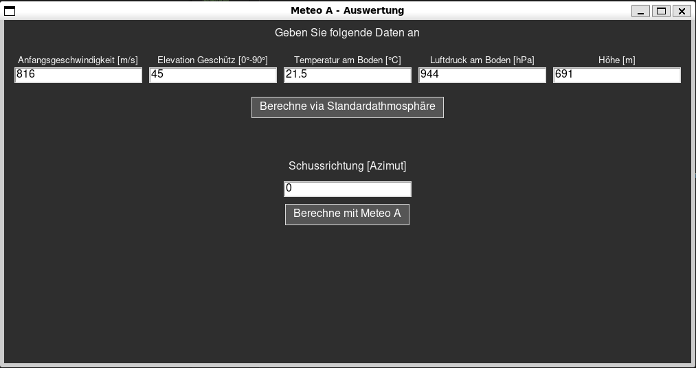
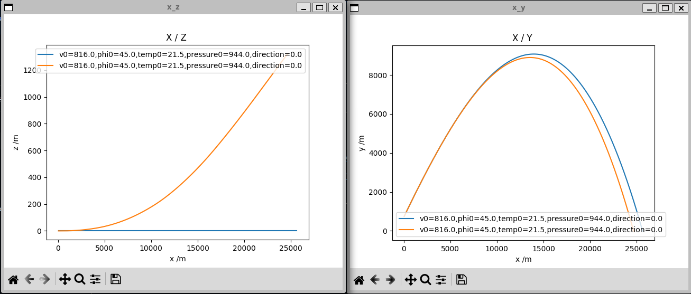

# Flugbahnrechner für die Artillerie

Dieses Project stellt einen Flugbahnrechner für die Artillerie zur Verfügung.

## Funktionsweise
Dieses Programm berechnet die Flugbahnen iterativ Schritt für Schritt beginnend zum Zeitpunkt, wenn das Projektil das Rohr verlässt. Es nähert somit die aussenballistischen Einflüsse auf die Flugbahn an. Dabei werden folgende Annahmen getroffen:

- Erdanziehungskraft g = 9.80665 m/s^2^
- Gewicht des Projektils = 42 kg
- Radius des Projektils = 7.7 cm
- Profilfläche des Projectils = 1250 cm^2

Von der Anfangsgeschwindigkeit v0 und der Elevation des Geschützes ergeben sich der initiale Geschwindigkeitsvektor. Der [Simulator](./simulator.py) iteriert danach in einem fixen Interval (delta_t = 0.1 s) über den aktuellen Geschwindikeitsvektor und berechnet Wiederstandskräfte aufgrund von Luftdichte, Geschwindigkeit und Wind.

## Download
Packete können rechts unter `Releases` gefunden und heruntergeladen werden. Bei der Ausführung wird Windows angeben, dass das Programm von unbekannter Herkunft stammt. Durch das Anklicken von "Weitere Informationen" kann die Ausführung trotzdem erlaubt werden. Die erste Ausführung wird etwas mehr Zeit in Anspruch nehmen.

## Verwendung
### Ohne Meteo A
Wenn der Simulator gestartet wird, werden folgende Optionen angeboten. 

Für die Verwendung des Simulators werden zuerst die folgenden Basisdaten benötigt:
- Anfangsgeschwindigkeit des Projektils in m/s
- Die Elevation in Grad.
- Die Bodentemperatur in Celsius
- Der Luftdruck am Boden in hPa
- Die Höhe, auf welcher das Projektil initial abgefeuert wird

Nach der Eingabe der Basisdaten kann die Flugbahn mittels der Standardathmosphäre berechnet werden. Dabei werden folgende Annahmen getroffen:
- Temperaturabnahme von 6.5 °C pro 1000m (Feuchtadiabatischer Temperaturgradient)
- Luftdruck basierend auf 1013.25 hPa auf Meereshöhe

Die Flugbahnen können mit alternierenden Eingaben wiederholt berechnet werden, was eine Überlagerung der Flugbahnkurven in den zwei resultierenden Graphen bewirkt.

### Mit Meteo A
Sofern ein Meteo A gegeben ist, kann dieses dem Simulator als `.csv` Datei zur Verfügung gestellt werden. Ein Beispiel dazu befindet sich [hier](./docs/meteo_a.csv). Falls das Meteo A fehlerhafte Daten (e.g. falsche Prüfsumme) enthält, wird die Berechnung nicht durchgeführt. Um den Einfluss vom Wind auf die Flugbahn zu berechnen, wird die Schussrichtung des Projektils (in Azimut) benötigt.

## Resultate
Die Ergebnisse werden als Grafiken über die X-Y Achsen und X-Z Achsen angezeigt. Dabei sind die Achsen wie folgt angeordnet:

- X-Achse: Länge
- Y-Achse: Höhe
- Z-Achse: Tiefe

